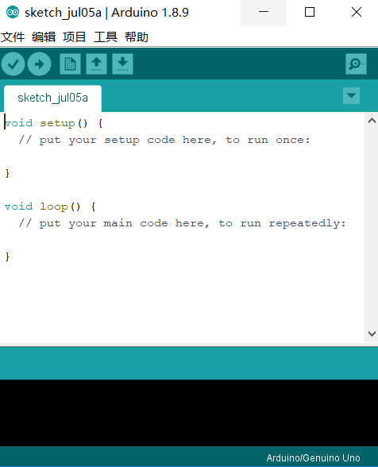
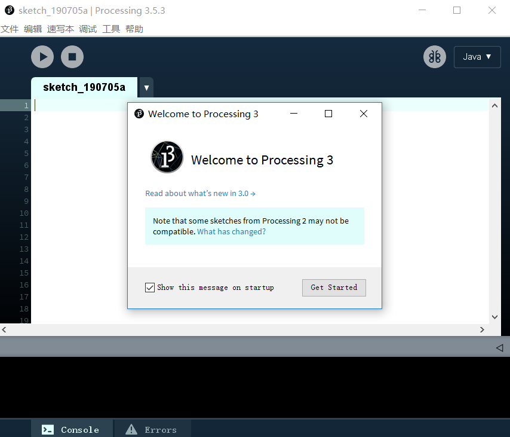
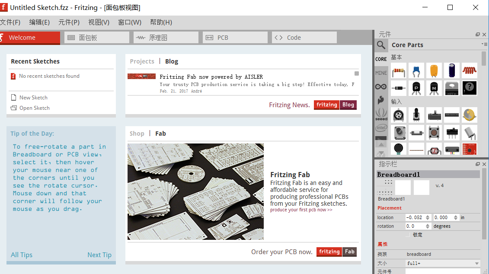
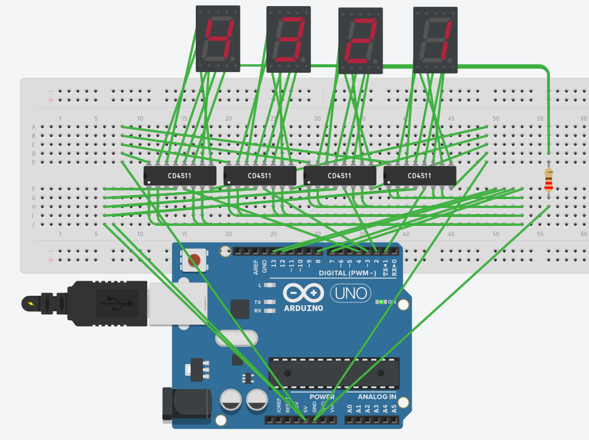
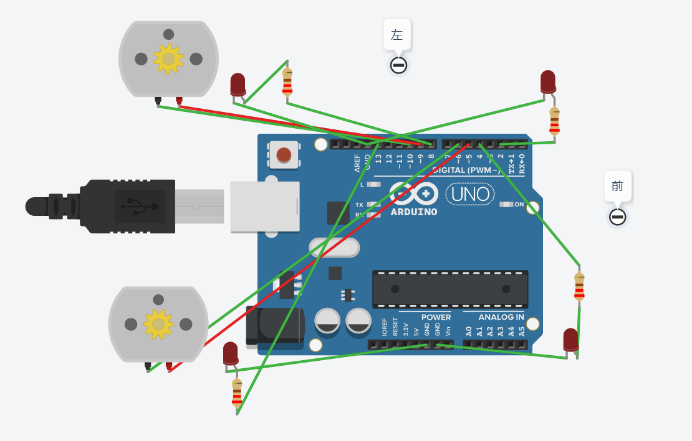
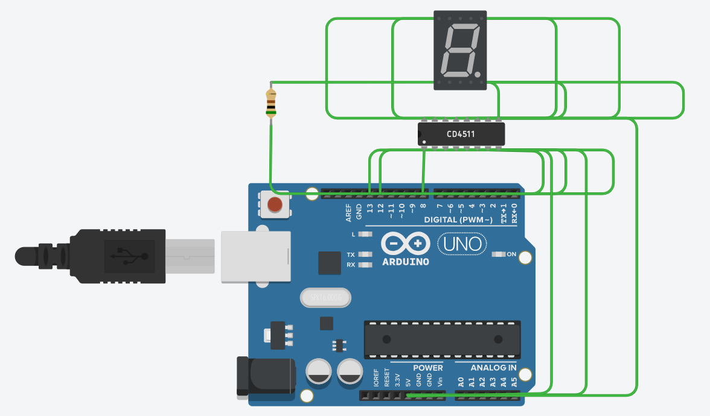
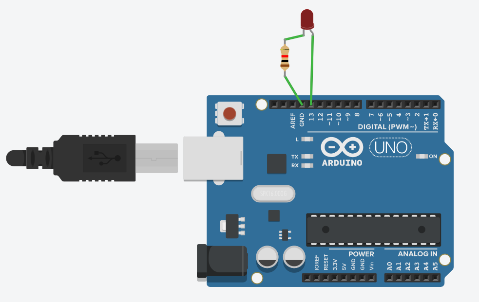

# 开源性实战
> 黄琨
> 2019.7.2-2019.7.5

日期|内容
---|---|
2019.7.3|Morse
2019.7.4|car / CD4511
2019.7.5|Morse（无库函数版）/ 4个led7

## 第一天 入门介绍

- 开源硬件是什么
- 为什么学习开源硬件
- 学习开源硬件需要哪些软件

### Arduino



### processing



### Fritzing



### 常用网站

- git官网：[https://git-scm.com](https://git-scm.com/)
- tinkercd官网:  [https://www.tinkercad.com](https://www.tinkercad.com/)
- Arduino官网:  [https://www.arduino.cc](https://www.arduino.cc/)

## 第二天 软件操作

- Linux权限（rwx）
- Arduino基本命令
- Arduino库函数形式
- 运用Arduino编写Morse代码


### Morse.h

```c
#ifndef _MORSE_H
#define _MORSE_H
class Morse
{
  public:
    Morse(int pin);
    void dot();
    void dash();
    void c_space();
    void w_space();
  private:
    int _pin;
    int _dottime;
};
#endif /*_MORSE_H*/
```

[Morse.cpp](Morse/Morse.cpp)

[Morse.ino](Morse/Morse.ino)


## 第三天 在线模拟

### car


[car.ino](car/car.ino)

### led7


[led7.ino](CD4511/CD4511.ino)

## 第四天 总结

### git 

- git clone
- git add.
- git commit -m" "
- git push

### Morse（无库函数版）


[Morse（无库函数版）.ino](Morse（无库函数版）/Morse.ino)

### 4个led7


[4个led7.ino](4个led7/led.ino)


